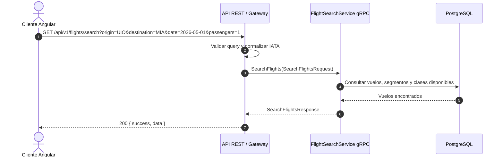
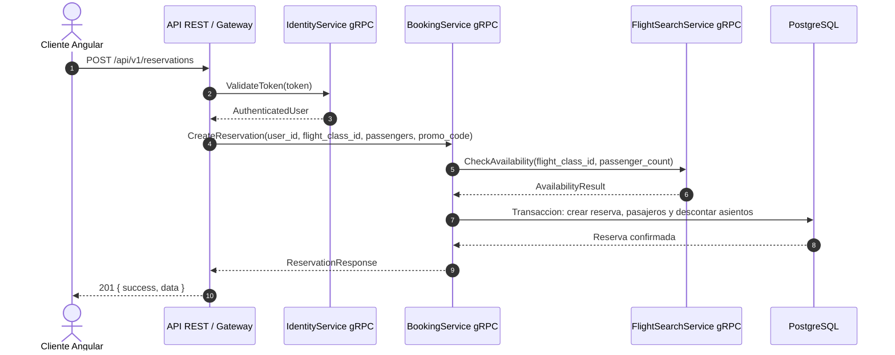
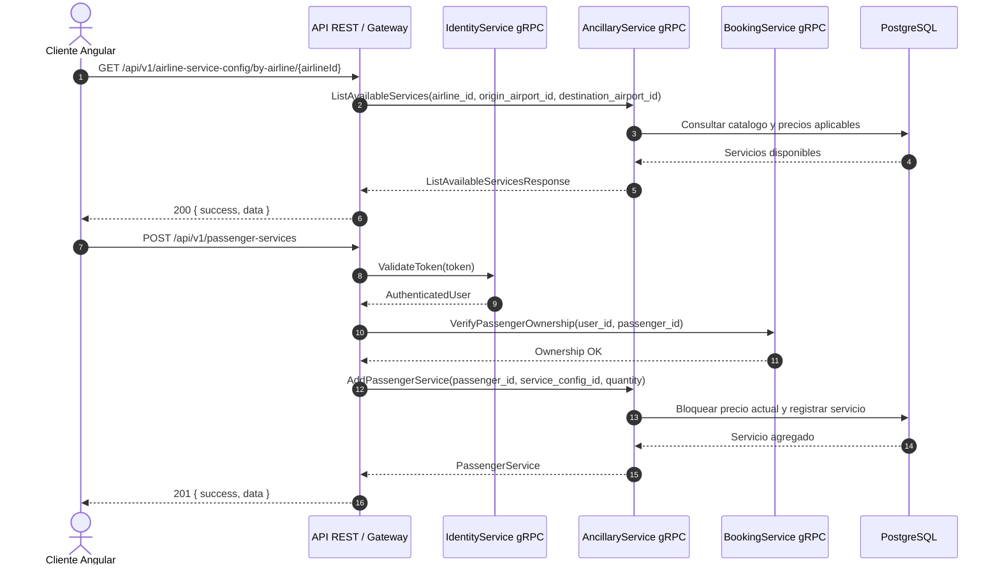

# Diagramas de secuencia para evolucion a gRPC

Este documento describe los flujos actuales y la separacion sugerida para migrar la comunicacion interna del backend a gRPC con Protocol Buffers 3. La API publica puede seguir siendo REST para Angular y para integraciones web, mientras que los servicios internos se comunican por gRPC.

## Servicios propuestos

- `FlightSearchService`: disponibilidad, rutas, clases y precios base de vuelos.
- `BookingService`: creacion/cancelacion de reservas, pasajeros y control de asientos.
- `AncillaryService`: catalogo y compra de servicios adicionales.
- `PaymentService`: pagos, facturas y conciliacion.
- `IdentityService`: autenticacion, usuarios y roles.

## 1. Busqueda de vuelos

Flujo actual REST con separacion objetivo para gRPC interno:



Contrato proto3 sugerido:

```proto
syntax = "proto3";

package flights.v1;

service FlightSearchService {
  rpc SearchFlights(SearchFlightsRequest) returns (SearchFlightsResponse);
}

message SearchFlightsRequest {
  string origin_iata = 1;
  string destination_iata = 2;
  string departure_date = 3;
  int32 passengers = 4;
  optional string cabin_class = 5;
}

message SearchFlightsResponse {
  repeated FlightOption flights = 1;
}
```

## 2. Creacion de reserva



Puntos de consistencia:

- La reserva y el descuento de asientos deben ser atomicos.
- El `BookingService` debe ser duenio de reservas y pasajeros.
- `FlightSearchService` debe exponer disponibilidad, pero no modificar reservas directamente.

## 3. Servicios adicionales de pasajero



Reglas para el proto:

- El cliente no debe mandar el precio definitivo; el servicio debe calcularlo desde `service_config_id`.
- El ownership del pasajero debe validarse antes de agregar o eliminar servicios.
- Para Booking.com u otro agregador, el gateway externo puede traducir REST/JSON a gRPC interno sin exponer la topologia interna.

