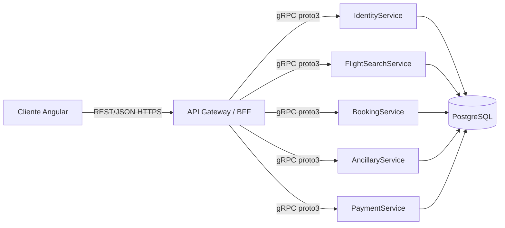
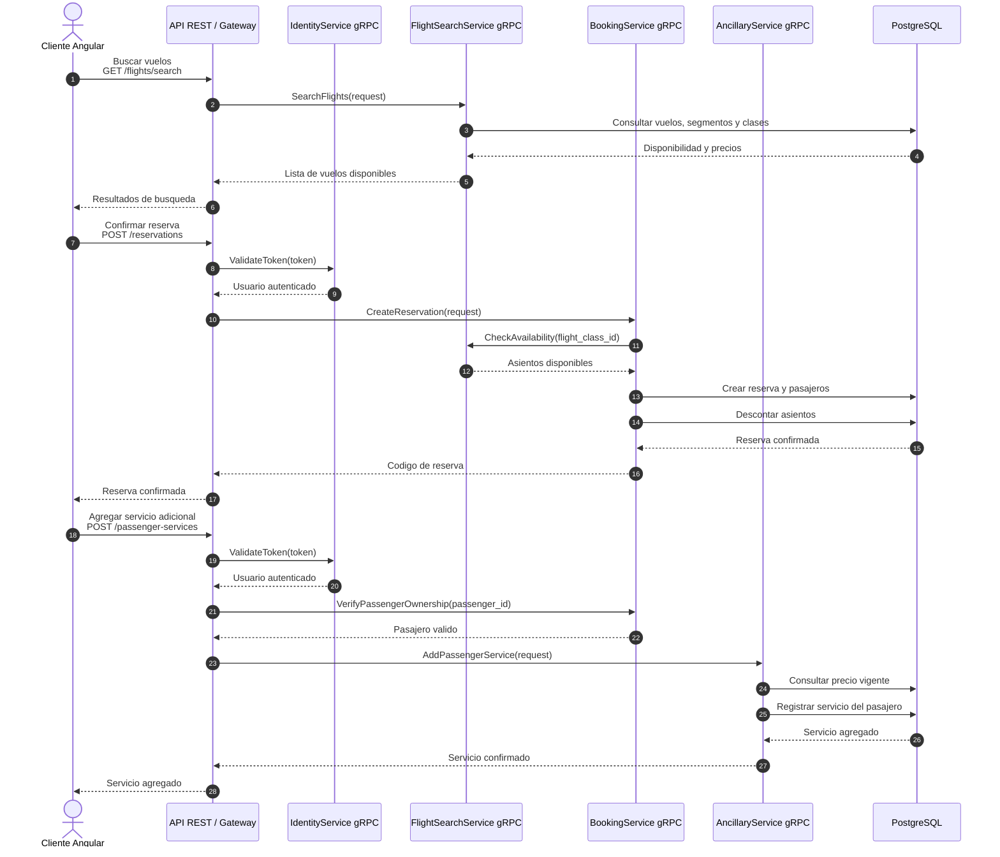
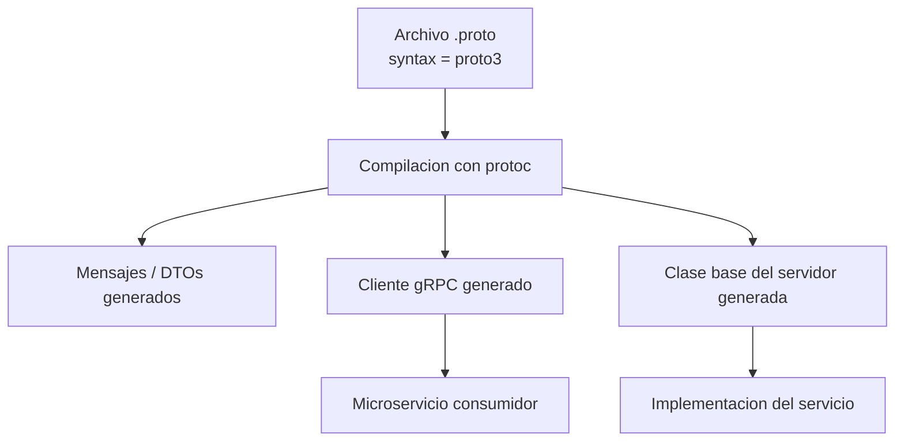
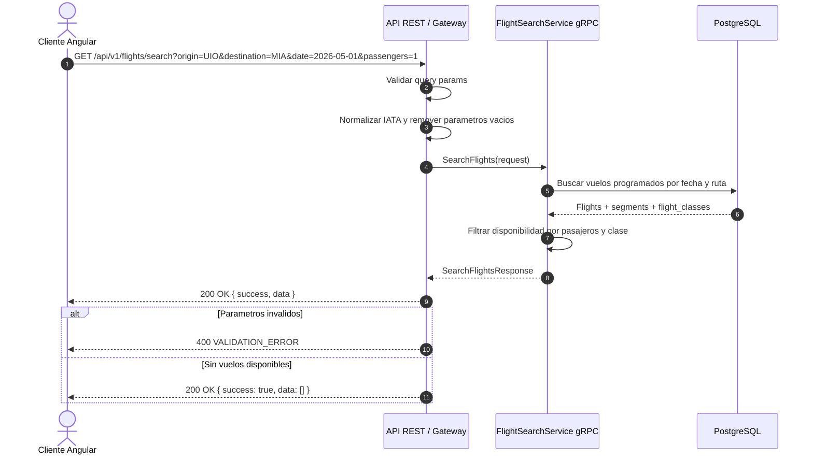
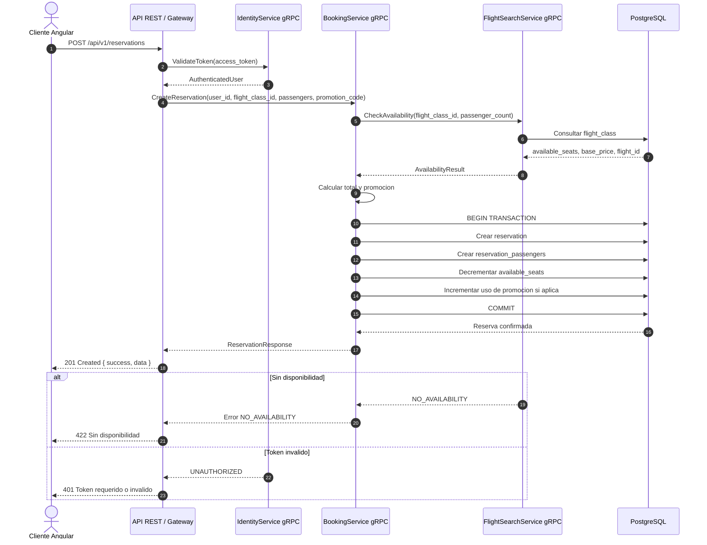
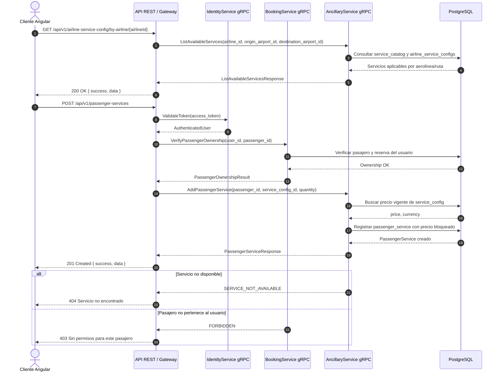
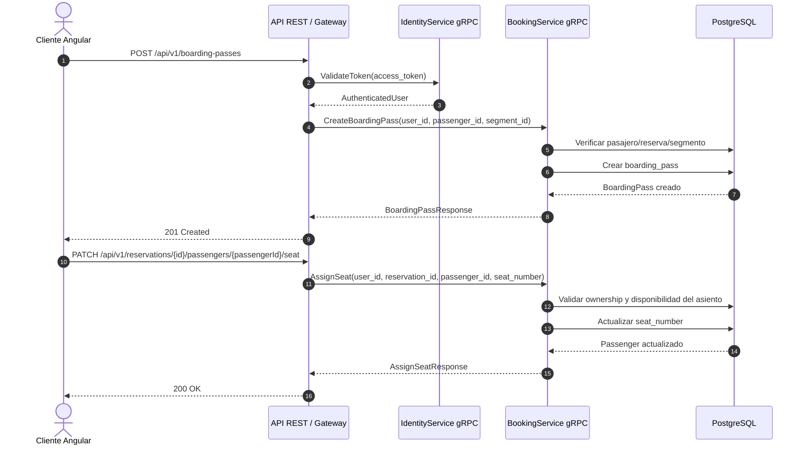
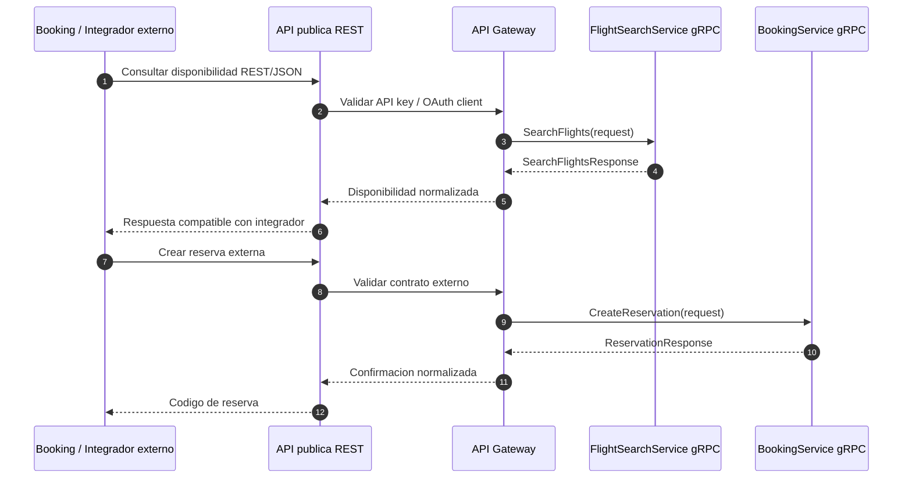

# Diagramas de secuencia - VuelosApp y evolucion a gRPC

Este documento sirve como base para explicar los flujos principales del sistema y como guia para evolucionar el backend desde un monolito modular REST hacia microservicios con comunicacion interna gRPC y Protocol Buffers 3.

La idea recomendada es mantener REST/JSON como contrato publico para Angular y futuros consumidores web, y usar gRPC solo entre servicios internos.

El analisis completo de gRPC, GraphQL, SOA, mensajeria, eventos de negocio y trazabilidad esta en `docs/documento-tecnico-reto1.md`.

## Vista objetivo



## Diagrama de secuencia general

Este es el diagrama principal para la documentacion. Resume el flujo completo desde que el cliente busca vuelos hasta que confirma una reserva y agrega servicios adicionales, mostrando donde entraria gRPC internamente.



## Pipeline de generacion gRPC

Este diagrama es equivalente al ejemplo del profesor, pero aplicado a la generacion automatica de codigo gRPC.



## Servicios sugeridos

- `IdentityService`: autenticacion, usuarios y roles.
- `FlightSearchService`: aeropuertos, rutas, vuelos, segmentos, clases y disponibilidad.
- `BookingService`: reservas, pasajeros, cancelacion, check-in y asientos.
- `AncillaryService`: catalogo de servicios adicionales y compra por pasajero.
- `PaymentService`: pagos, facturas y conciliacion.

## 1. Busqueda de vuelos

Este flujo representa cuando el cliente busca una ruta, por ejemplo `UIO -> MIA`.



Contrato proto3 sugerido:

```proto
syntax = "proto3";

package flights.v1;

service FlightSearchService {
  rpc SearchFlights(SearchFlightsRequest) returns (SearchFlightsResponse);
}

message SearchFlightsRequest {
  string origin_iata = 1;
  string destination_iata = 2;
  string departure_date = 3; // YYYY-MM-DD
  int32 passengers = 4;
  optional string cabin_class = 5;
}

message SearchFlightsResponse {
  repeated FlightOption flights = 1;
}

message FlightOption {
  string id = 1;
  string origin_iata = 2;
  string destination_iata = 3;
  string departure_datetime = 4;
  string arrival_datetime = 5;
  string airline_name = 6;
  double lowest_price = 7;
  repeated CabinAvailability cabins = 8;
}

message CabinAvailability {
  string flight_class_id = 1;
  string cabin_class = 2;
  int32 available_seats = 3;
  double base_price = 4;
}
```

## 2. Crear reserva

Este flujo ocurre cuando el usuario selecciona una clase de vuelo, registra pasajeros y confirma la reserva.



Contrato proto3 sugerido:

```proto
syntax = "proto3";

package booking.v1;

service BookingService {
  rpc CreateReservation(CreateReservationRequest) returns (ReservationResponse);
}

message CreateReservationRequest {
  string user_id = 1;
  string flight_class_id = 2;
  repeated PassengerInput passengers = 3;
  optional string promotion_code = 4;
}

message PassengerInput {
  string first_name = 1;
  string last_name = 2;
  string document_number = 3;
}

message ReservationResponse {
  string id = 1;
  string reservation_code = 2;
  string status = 3;
  double total_amount = 4;
  repeated Passenger passengers = 5;
}

message Passenger {
  string id = 1;
  string first_name = 2;
  string last_name = 3;
  string document_number = 4;
}
```

## 3. Agregar servicios adicionales

Este flujo cubre la pantalla de detalle de reserva, cuando el cliente abre un pasajero y agrega maleta, comida, seguro u otro servicio.



Contrato proto3 sugerido:

```proto
syntax = "proto3";

package ancillary.v1;

service AncillaryService {
  rpc ListAvailableServices(ListAvailableServicesRequest) returns (ListAvailableServicesResponse);
  rpc AddPassengerService(AddPassengerServiceRequest) returns (PassengerServiceResponse);
}

message ListAvailableServicesRequest {
  string airline_id = 1;
  optional string origin_airport_id = 2;
  optional string destination_airport_id = 3;
}

message ListAvailableServicesResponse {
  repeated ServiceConfig services = 1;
}

message ServiceConfig {
  string id = 1;
  string service_id = 2;
  string name = 3;
  string category = 4;
  double price = 5;
  string currency = 6;
}

message AddPassengerServiceRequest {
  string passenger_id = 1;
  string service_config_id = 2;
  int32 quantity = 3;
}

message PassengerServiceResponse {
  string id = 1;
  string passenger_id = 2;
  string service_config_id = 3;
  int32 quantity = 4;
  double unit_price_at_booking = 5;
  double total_price = 6;
}
```

## 4. Check-in y asignacion de asiento



## Reglas de diseno para gRPC

- Usar `syntax = "proto3";` en todos los contratos.
- Versionar paquetes: `flights.v1`, `booking.v1`, `ancillary.v1`, `identity.v1`.
- No exponer gRPC directamente al navegador; Angular consume REST/JSON.
- El Gateway traduce REST a gRPC interno.
- No confiar en precios enviados por el cliente. El servicio interno debe bloquear el precio vigente.
- Usar errores canonicos gRPC: `INVALID_ARGUMENT`, `UNAUTHENTICATED`, `PERMISSION_DENIED`, `NOT_FOUND`, `FAILED_PRECONDITION`.
- Mantener idempotencia para operaciones sensibles cuando se integre con pagos o agregadores externos.

## Flujo recomendado para integracion con Booking


