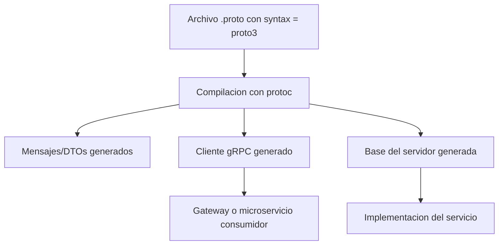
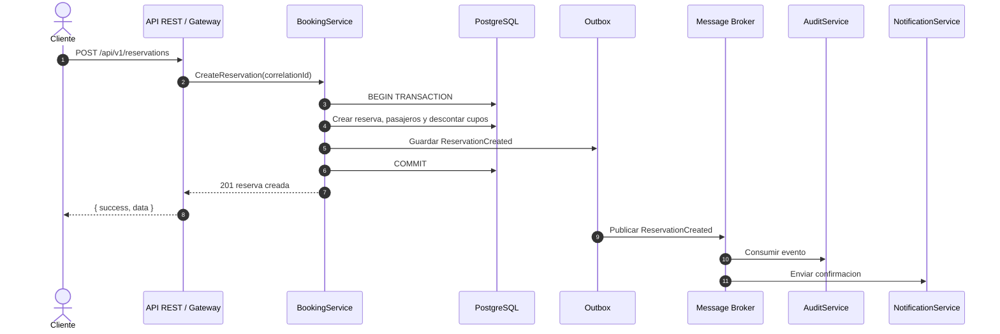

# Documento tecnico Reto 1 - Integracion VuelosApp

Este documento completa la justificacion arquitectonica del Reto 1 hasta la semana 6. El sistema actual mantiene REST/JSON como contrato publico estable para Angular, Postman, Swagger y futuros integradores. gRPC, GraphQL, mensajeria y EDA se documentan como evolucion planificada; no se declaran como endpoints productivos mientras no esten implementados, para evitar errores durante pruebas del frontend.

## 1. Alcance API-first

VuelosApp resuelve la busqueda, reserva y administracion de vuelos dentro de una plataforma academica tipo Booking. El sistema incluye:

- Frontend marketplace para clientes: busqueda de vuelos, resultados, reserva, mis viajes, check-in, mapa de asientos y extras.
- Sistema administrativo: gestion de catalogos, vuelos, segmentos, reservas, pagos, facturas, servicios, promociones, usuarios y auditoria.
- Backend REST versionado bajo `/api/v1`.
- Base de datos PostgreSQL gestionada con Prisma.
- Documentacion OpenAPI para los endpoints REST reales.

Actores principales:

- Cliente final: busca vuelos, reserva, gestiona pasajeros, agrega extras y consulta sus viajes.
- Administrador: mantiene catalogos, disponibilidad, precios, promociones y auditoria.
- Integrador Booking futuro: consume disponibilidad y crea reservas mediante un contrato publico.
- Servicios internos futuros: identidad, busqueda, reservas, extras, pagos y auditoria.

Regla de proteccion para pruebas: Angular sigue consumiendo REST/JSON. GraphQL y gRPC no reemplazan ningun endpoint existente en Reto 1.

## 2. Contrato OpenAPI

El OpenAPI debe describir solo la API REST disponible actualmente. No conviene agregar al OpenAPI rutas conceptuales de GraphQL o gRPC porque el profesor podria probarlas y recibir errores.

Lineamientos:

- Mantener `/api/v1` como prefijo estable.
- Mantener respuestas con envoltorio `{ success, data }` y `{ success, error }`.
- Documentar solo endpoints existentes.
- Usar `Authorization: Bearer <token>` en rutas protegidas.
- Usar `x-correlation-id` como encabezado opcional para trazabilidad. Si el cliente no lo envia, el backend genera uno y lo devuelve como `X-Correlation-Id`.
- Exponer la especificacion en `/api/v1/docs.json` y como alias compatible en `/api/v1/spec`.

No se cambia el contrato REST por agregar esta documentacion. Las mejoras de gRPC, GraphQL, SOA y EDA son preparacion arquitectonica para integracion.

## 3. Analisis gRPC y Protocol Buffers 3

### Decision arquitectonica

gRPC no se expone al navegador. Angular y Booking consumen REST/JSON mediante un API Gateway o BFF. gRPC se usa solo entre servicios internos cuando el monolito modular evolucione a microservicios.

Motivos:

- Contratos binarios mas eficientes para llamadas internas de alta frecuencia.
- Tipado fuerte con `proto3`.
- Generacion automatica de clientes y servidores.
- Versionado por paquete, por ejemplo `flights.v1`, `booking.v1`, `ancillary.v1`.
- Mejor separacion entre contrato publico REST y comunicacion interna.

### Servicios gRPC candidatos

| Servicio | Modulo actual | RPCs candidatos | Motivo |
|---|---|---|---|
| `IdentityService` | `api_users` | `ValidateToken`, `GetUser`, `CheckRole` | Autenticacion central para gateway y servicios internos |
| `FlightSearchService` | `api_flights`, `api_segments`, `api_airports` | `SearchFlights`, `GetFlight`, `CheckAvailability` | Consultas de disponibilidad y rutas con alta reutilizacion |
| `BookingService` | `api_reservations`, `api_reservation_passengers` | `CreateReservation`, `CancelReservation`, `AssignSeat`, `VerifyPassengerOwnership` | Logica transaccional de reservas y pasajeros |
| `AncillaryService` | `api_service_catalog`, `api_airline_service_configs`, `api_passenger_services` | `ListAvailableServices`, `AddPassengerService`, `RemovePassengerService` | Extras dependientes de aerolinea, ruta y pasajero |
| `PaymentService` | `api_payments`, `api_invoices`, `api_invoice_items` | `CreatePayment`, `IssueInvoice`, `GetReservationPayments` | Pagos, facturacion y conciliacion |
| `AuditService` | `api_audit_logs` | `WriteAuditLog`, `FindAuditTrail` | Trazabilidad transversal |

### Pipeline de generacion



### Reglas de contrato

- Todos los archivos `.proto` usan `syntax = "proto3";`.
- Los paquetes se versionan: `identity.v1`, `flights.v1`, `booking.v1`, `ancillary.v1`, `payment.v1`.
- Los identificadores viajan como `string` para soportar UUID/CUID.
- Las fechas viajan como ISO-8601 o `google.protobuf.Timestamp`.
- Los precios viajan como `int64 amount_minor` o `string decimal_amount` en produccion; para el prototipo se puede documentar `double`.
- Errores gRPC se mapean a HTTP en el Gateway:
  - `INVALID_ARGUMENT` -> `400`
  - `UNAUTHENTICATED` -> `401`
  - `PERMISSION_DENIED` -> `403`
  - `NOT_FOUND` -> `404`
  - `FAILED_PRECONDITION` -> `409` o `422`
  - `INTERNAL` -> `500`
- El `x-correlation-id` REST pasa como metadata gRPC `x-correlation-id`.

### Migracion segura

1. Mantener REST actual.
2. Crear interfaces internas por dominio.
3. Extraer `FlightSearchService` como primer microservicio por ser mayormente consulta.
4. Mover el Gateway a llamar gRPC internamente.
5. Mantener las mismas respuestas REST para Angular.
6. Agregar contract tests REST para evitar regresiones en el frontend.

## 4. Analisis GraphQL

### Decision arquitectonica

GraphQL complementa REST, no lo reemplaza en Reto 1. Su valor aparece cuando Booking o el frontend necesitan vistas agregadas que hoy requieren varias llamadas REST.

No se debe agregar `/api/v1/graphql` al OpenAPI hasta implementar realmente un servidor GraphQL. En esta etapa queda documentado como propuesta conceptual.

### Casos donde GraphQL aporta valor

| Caso | Problema con REST puro | Consulta GraphQL propuesta |
|---|---|---|
| Resultados de marketplace | El frontend necesita vuelo, aerolinea, aeropuertos, segmentos, clases y precio minimo | `flightSearch(input)` |
| Detalle de reserva | Mis viajes requiere reserva, vuelo, pasajeros, boarding pass, extras, pagos e invoice | `reservationDetail(id)` |
| Checkout de extras | Se requiere total pagado, extras, asiento, impuestos simulados y metodo de pago | `extrasCheckout(reservationId)` |
| Dashboard admin | Indicadores cruzan reservas, pagos, vuelos y usuarios | `adminDashboard(range)` |
| Integrador Booking | Necesita disponibilidad normalizada con pocos campos variables | `externalAvailability(input)` |

### Esquema conceptual

```graphql
type Query {
  flightSearch(input: FlightSearchInput!): [FlightOption!]!
  reservationDetail(id: ID!): ReservationDetail!
  adminDashboard(range: DateRangeInput!): AdminDashboard!
}

type Mutation {
  addAncillary(input: AddAncillaryInput!): PassengerService!
  assignSeat(input: AssignSeatInput!): SeatAssignment!
}
```

### Seguridad GraphQL

- JWT obligatorio para datos privados.
- Roles por resolver: `CUSTOMER` para sus reservas, `ADMIN` para dashboard y catalogos.
- Validacion de ownership antes de devolver reservas o pasajeros.
- Limite de profundidad de consulta.
- Limite de complejidad por query.
- Persisted queries para integradores externos.
- Rate limiting por usuario/API key.
- Deshabilitar introspeccion en produccion publica si no hay autenticacion.
- Nunca permitir que GraphQL calcule precios desde datos enviados por el cliente; debe consultar servicios internos.

### Proteccion para no romper el frontend

- Angular continua usando `FlightsService`, `ReservationsService`, `PassengerServicesService`, etc. por REST.
- GraphQL se introduce como adaptador opcional de lectura agregada.
- Si GraphQL falla, la UI puede mantener fallback REST.
- No se elimina ningun endpoint REST existente.
- No se agrega una ruta GraphQL al OpenAPI hasta que existan pruebas y backend real.

## 5. SOA, ESB y mensajeria

### Punto 5 mejorado: operaciones como servicios

En la arquitectura actual existe un monolito modular. Para SOA, cada modulo se convierte gradualmente en servicio con responsabilidad clara y contrato estable.

| Servicio SOA | Responsabilidad | Contrato sincronico | Eventos que publica | Datos principales |
|---|---|---|---|---|
| Identity | Usuarios, login, roles y tokens | REST/gRPC `ValidateToken`, `GetUser` | `UserRegistered`, `UserRoleChanged` | `User` |
| Flight Catalog | Aeropuertos, aerolineas, aeronaves, vuelos y segmentos | REST/gRPC `SearchFlights`, `CheckAvailability` | `FlightCreated`, `FlightScheduleChanged`, `AvailabilityChanged` | `Airport`, `Airline`, `Flight`, `Segment`, `FlightClass` |
| Booking | Reservas, pasajeros, cancelacion y asientos | REST/gRPC `CreateReservation`, `CancelReservation`, `AssignSeat` | `ReservationCreated`, `ReservationCancelled`, `SeatAssigned` | `Reservation`, `ReservationPassenger` |
| Ancillary | Servicios adicionales por aerolinea/ruta/pasajero | REST/gRPC `ListAvailableServices`, `AddPassengerService` | `AncillaryAdded`, `AncillaryRemoved` | `ServiceCatalog`, `AirlineServiceConfig`, `PassengerService` |
| Payment | Pagos, facturas e items | REST/gRPC `CreatePayment`, `IssueInvoice` | `PaymentRegistered`, `InvoiceIssued` | `Payment`, `Invoice`, `InvoiceItem` |
| Audit | Registro de cambios y trazabilidad | REST/gRPC `WriteAuditLog` | `AuditLogWritten` | `AuditLog` |
| Notification futuro | Emails, comprobantes y mensajes operativos | Async consumer | `NotificationSent`, `NotificationFailed` | Plantillas y logs |

### ESB/API Gateway propuesto

Para el Reto 1 se usa una API REST unica. En la evolucion:

- El API Gateway recibe REST/JSON desde Angular y Booking.
- Valida JWT o API key.
- Normaliza requests externas.
- Propaga `x-correlation-id`.
- Traduce REST a gRPC interno cuando existan microservicios.
- Publica eventos de integracion mediante un message broker.

El ESB o broker no debe contener reglas de negocio; solo enruta, transforma mensajes minimos, aplica seguridad, reintentos y observabilidad.

### Topicos y colas propuestas

| Canal | Tipo | Productores | Consumidores | Uso |
|---|---|---|---|---|
| `vuelos.booking.events` | Topic | BookingService | Payment, Audit, Notification, Booking externo | Reservas creadas/canceladas |
| `vuelos.flight.events` | Topic | FlightCatalogService | Marketplace, Booking, Audit | Cambios de vuelos y disponibilidad |
| `vuelos.ancillary.events` | Topic | AncillaryService | Payment, Invoice, Audit | Extras agregados/removidos |
| `vuelos.payment.events` | Topic | PaymentService | Invoice, Notification, Audit | Pagos registrados y conciliados |
| `vuelos.audit.events` | Queue | Todos los servicios | AuditService | Auditoria centralizada |
| `vuelos.dead-letter` | Queue | Broker | Operador/Admin | Mensajes fallidos |

### Envelope de mensaje

```json
{
  "eventId": "evt_01HX...",
  "eventType": "ReservationCreated",
  "eventVersion": 1,
  "occurredAt": "2026-04-27T18:00:00.000Z",
  "producer": "BookingService",
  "correlationId": "corr_01HX...",
  "causationId": "cmd_01HX...",
  "actor": {
    "type": "CUSTOMER",
    "id": "user_123"
  },
  "payload": {}
}
```

Buenas practicas:

- Outbox pattern para publicar eventos despues de confirmar la transaccion de BD.
- Idempotency key en comandos sensibles como reserva, pago y extras.
- Dead-letter queue para mensajes que fallan tras reintentos.
- Versionado de eventos por `eventVersion`.
- Schema registry o carpeta `/contracts/events` cuando se implemente.
- Reintentos exponenciales para consumidores.

## 6. Catalogo de eventos de negocio con trazabilidad

| Evento | Disparador | Productor | Consumidores futuros | Entidades afectadas | Payload minimo | Trazabilidad |
|---|---|---|---|---|---|---|
| `UserRegistered` | Registro exitoso | Identity | Audit, Notification | `User` | `userId`, `email`, `role` | `correlationId`, `actorId=userId` |
| `FlightSearchRequested` | Busqueda marketplace | FlightSearch/Gateway | Analytics, Audit | Ninguna transaccional | `origin`, `destination`, `date`, `passengers` | `correlationId`, `sessionId/userId` |
| `FlightCreated` | Admin crea vuelo | Flight Catalog | Audit, Marketplace cache | `Flight`, `Segment`, `FlightClass` | `flightId`, `route`, `departureDateTime` | `correlationId`, `adminId` |
| `FlightScheduleChanged` | Admin edita horario | Flight Catalog | Booking, Notification, Audit | `Flight`, `Segment` | `flightId`, `oldTime`, `newTime` | `correlationId`, `adminId` |
| `AvailabilityChanged` | Reserva/cancelacion cambia cupos | Flight Catalog/Booking | Marketplace, Booking externo | `FlightClass` | `flightClassId`, `availableSeats` | `correlationId`, `reservationId` |
| `ReservationCreated` | Cliente confirma reserva | Booking | Payment, Invoice, Audit, Notification | `Reservation`, `ReservationPassenger`, `FlightClass` | `reservationId`, `reservationCode`, `userId`, `totalAmount` | `correlationId`, `userId`, `reservationId` |
| `ReservationCancelled` | Cliente/admin cancela | Booking | Payment, Flight Catalog, Audit, Notification | `Reservation`, `FlightClass` | `reservationId`, `reason`, `releasedSeats` | `correlationId`, `userId/adminId` |
| `PromotionApplied` | Reserva con cupon valido | Booking | Audit, Analytics | `Promotion`, `Reservation` | `promotionId`, `code`, `discountAmount` | `correlationId`, `reservationId` |
| `SeatAssigned` | Cliente elige asiento | Booking | Payment, Audit | `ReservationPassenger` | `reservationId`, `passengerId`, `seatNumber`, `seatFee` | `correlationId`, `passengerId` |
| `CheckInCompleted` | Boarding pass creado | Booking | Notification, Audit | `BoardingPass`, `ReservationPassenger` | `boardingPassId`, `passengerId`, `segmentId` | `correlationId`, `reservationId` |
| `AncillaryAdded` | Cliente agrega extra | Ancillary | Payment, Invoice, Audit | `PassengerService` | `passengerServiceId`, `passengerId`, `serviceConfigId`, `amount` | `correlationId`, `reservationId`, `passengerId` |
| `AncillaryRemoved` | Cliente/admin elimina extra | Ancillary | Payment, Invoice, Audit | `PassengerService` | `passengerServiceId`, `amount` | `correlationId`, `reservationId` |
| `PaymentRegistered` | Pago creado | Payment | Invoice, Notification, Audit | `Payment` | `paymentId`, `reservationId`, `amount`, `provider`, `status` | `correlationId`, `transactionId` |
| `InvoiceIssued` | Factura emitida | Payment/Invoice | Notification, Audit | `Invoice`, `InvoiceItem` | `invoiceId`, `paymentId`, `totalAmount` | `correlationId`, `invoiceId` |
| `AdminCatalogChanged` | Admin modifica catalogo | Admin/API | Audit, Cache | Catalogos varios | `entity`, `entityId`, `operation` | `correlationId`, `adminId` |
| `AuditLogWritten` | Registro de auditoria creado | Audit | Observability | `AuditLog` | `auditLogId`, `action`, `entityName`, `entityId` | `correlationId`, `actorId` |

### Matriz de trazabilidad por flujo

| Flujo frontend | Endpoint REST actual | Servicio responsable | Tablas | Evento principal | Correlation ID |
|---|---|---|---|---|---|
| Buscar vuelos | `GET /api/v1/flights/search` | FlightSearch | `Flight`, `Segment`, `FlightClass`, `Airport` | `FlightSearchRequested` | Request/response header |
| Crear reserva | `POST /api/v1/reservations` | Booking | `Reservation`, `ReservationPassenger`, `FlightClass`, `Promotion` | `ReservationCreated` | Se propaga a DB audit/evento |
| Cancelar reserva | `PATCH /api/v1/reservations/{id}/cancel` | Booking | `Reservation`, `FlightClass` | `ReservationCancelled` | Se vincula con `reservationId` |
| Asignar asiento | `PATCH /api/v1/reservations/{id}/passengers/{passengerId}/seat` | Booking | `ReservationPassenger` | `SeatAssigned` | Se vincula con `passengerId` |
| Hacer check-in | `POST /api/v1/boarding-passes` | Booking | `BoardingPass` | `CheckInCompleted` | Se vincula con `segmentId` |
| Agregar extra | `POST /api/v1/passenger-services` | Ancillary | `PassengerService`, `AirlineServiceConfig` | `AncillaryAdded` | Se vincula con `passengerId` |
| Registrar pago | `POST /api/v1/payments` | Payment | `Payment` | `PaymentRegistered` | Se vincula con `transactionId` |
| Emitir factura | `POST /api/v1/invoices` | Payment/Invoice | `Invoice`, `InvoiceItem` | `InvoiceIssued` | Se vincula con `paymentId` |
| Admin edita catalogo | `/api/v1/admin/*` | Admin/API | Entidad administrada | `AdminCatalogChanged` | Se vincula con `adminId` |

### Secuencia EDA propuesta para reserva



## 7. Checklist de proteccion para pruebas frontend

- No publicar rutas conceptuales en OpenAPI.
- Mantener `/api/v1` y los nombres de campos actuales.
- Si se agrega GraphQL, debe ser adicional y no reemplazar servicios Angular existentes.
- Si se extrae gRPC, el Gateway debe conservar el mismo contrato REST.
- Todo endpoint protegido debe validar JWT y ownership.
- Las operaciones de extras y asientos no deben confiar en precios enviados por el cliente.
- Los errores deben conservar el formato `{ success: false, error: { code, message } }`.
- Toda respuesta debe devolver `X-Correlation-Id` para rastrear fallos.

## 8. Estado para semana 6

| Semana | Tema | Estado del proyecto |
|---|---|---|
| 1 | API-first, actores y alcance | Cubierto en este documento y README |
| 2 | REST, versionado y OpenAPI | Implementado en `/api/v1` y OpenAPI |
| 3 | gRPC/protobuf 3 | Analisis, servicios candidatos y diagramas listos |
| 4 | GraphQL/federacion | Analisis conceptual y seguridad documentados |
| 5 | SOA/ESB/mensajeria | Servicios, gateway, topics y envelope documentados |
| 6 | EDA | Catalogo de eventos y trazabilidad documentados |

