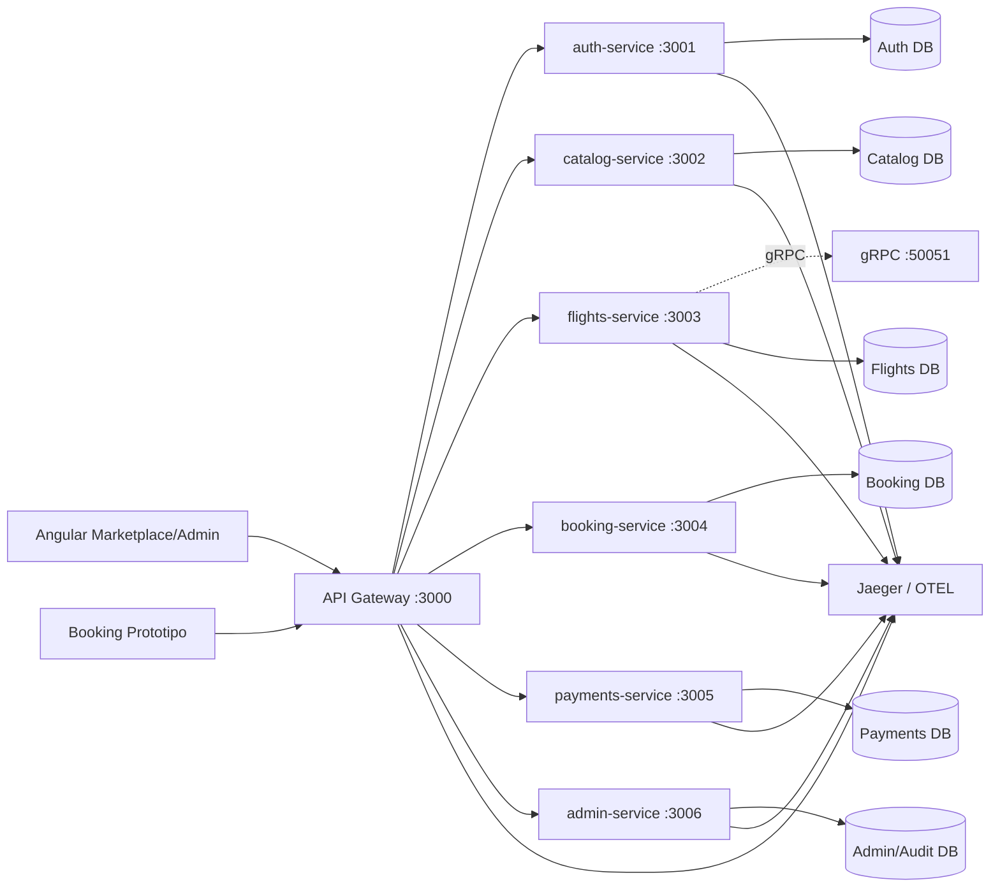
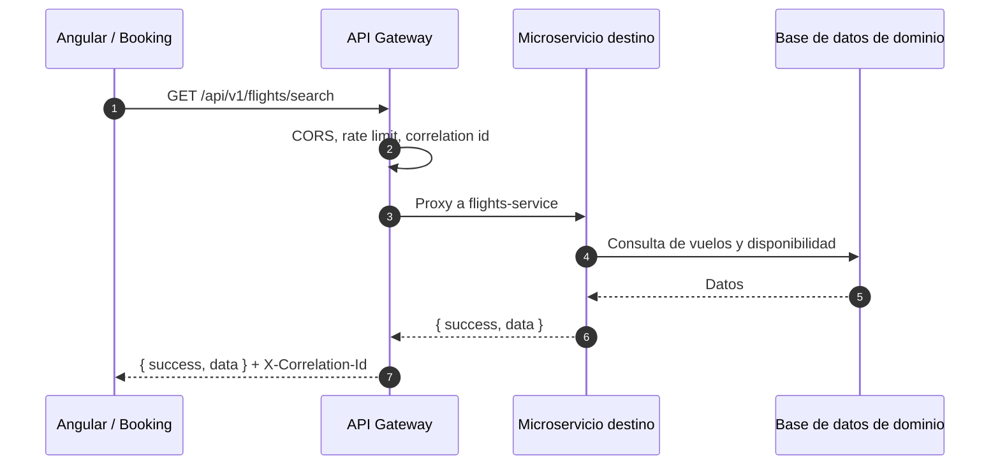
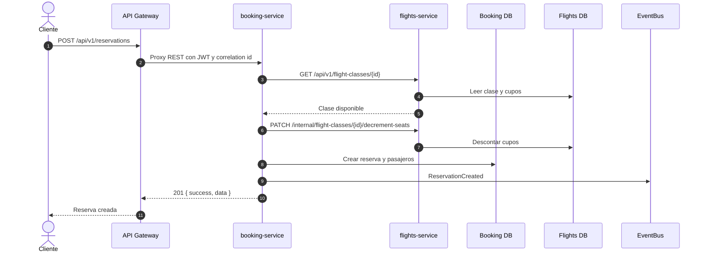

# Documento tecnico Reto 2 - Sistema VuelosApp

Este documento actualiza la documentacion tecnica del proyecto para el Reto 2, correspondiente a las semanas 7 a 11 de Integracion de Sistemas. El alcance se basa en el enunciado del proyecto `Booking Prototipo` y en la implementacion actual del repositorio `Sistema_vuelos.v1`.

El sistema se trata como un sistema individual de venta y reserva de vuelos que debe integrarse con el Booking Prototipo. Para Reto 2, la arquitectura evoluciona desde una API REST centralizada hacia microservicios con API Gateway, contratos versionados, observabilidad, seguridad y una estrategia de pruebas de integracion.

## 1. Alcance del Reto 2

Objetivo del reto:

- Migrar la aplicacion a una arquitectura de microservicios.
- Exponer servicios desacoplados para integracion con Booking Prototipo.
- Mantener el marketplace web y el panel administrativo.
- Incorporar API Gateway, contratos versionados, pruebas, observabilidad y seguridad.
- Desplegar una version distribuida y defendible tecnicamente.

Estado actual del proyecto:

| Entregable Reto 2 | Estado en el repositorio |
|---|---|
| Arquitectura migrada a microservicios | Implementada mediante entrypoints por servicio y `docker-compose.yml` |
| API Gateway configurado | Implementado en `api-gateway` con proxy REST, GraphQL, rate limit y circuit breaker |
| Contratos versionados | REST bajo `/api/v1`, GraphQL en `/graphql`, contratos gRPC en `src/grpc/proto` |
| Integracion servicio a servicio | Implementada entre Booking y Flights mediante cliente HTTP interno e `x-internal-api-key` |
| Observabilidad y trazabilidad | OpenTelemetry, Jaeger, logs JSON y `X-Correlation-Id` |
| Seguridad | JWT, roles, ownership, CORS, Helmet, rate limiting e internal API key |
| Evidencia de pruebas | Parcial. Existe un spec Angular, pero falla; no hay pruebas backend/gateway automatizadas |

## 2. Arquitectura general

La arquitectura de Reto 2 usa un API Gateway como punto de entrada y varios servicios de dominio desplegables de forma independiente.



Decision arquitectonica:

- El frontend no consume directamente los microservicios; consume el API Gateway.
- REST/JSON sigue siendo el contrato publico principal para Angular y para integracion externa.
- GraphQL actua como agregador opcional para vistas que combinan varios servicios.
- gRPC queda disponible como contrato interno o para integracion con Booking Prototipo.
- El monolito `vuelos-backend/src/server.ts` permanece como compatibilidad, pero el despliegue de Reto 2 debe usar los entrypoints de microservicios.

## 3. Inventario de microservicios

| Servicio | Puerto | Entry point | Responsabilidad | Base de datos / schema |
|---|---:|---|---|---|
| API Gateway | 3000 | `api-gateway/src/server.ts` | Entrada publica, proxy REST, GraphQL, seguridad perimetral, health agregado | No aplica |
| Auth Service | 3001 | `vuelos-backend/src/services/auth-service.ts` | Login, registro, validacion de token activo | `auth.schema.prisma` |
| Catalog Service | 3002 | `vuelos-backend/src/services/catalog-service.ts` | Paises, ciudades, aeropuertos, aerolineas, aeronaves, catalogos | `catalog.schema.prisma` |
| Flights Service | 3003 / 50051 | `vuelos-backend/src/services/flights-service.ts` | Vuelos, segmentos, clases, promociones, disponibilidad, gRPC | `flights.schema.prisma` |
| Booking Service | 3004 | `vuelos-backend/src/services/booking-service.ts` | Reservas, pasajeros, perfiles de facturacion, boarding passes | `booking.schema.prisma` |
| Payments Service | 3005 | `vuelos-backend/src/services/payments-service.ts` | Pagos, facturas, items, servicios extra de pasajero | `payments.schema.prisma` |
| Admin Service | 3006 | `vuelos-backend/src/services/admin-service.ts` | Dashboard administrativo, usuarios y auditoria | `admin.schema.prisma` y clientes de lectura por dominio |

El archivo `docker-compose.yml` orquesta:

- `api-gateway`
- `auth-service`
- `catalog-service`
- `flights-service`
- `booking-service`
- `payments-service`
- `admin-service`
- `jaeger`

Cada servicio backend se construye desde el mismo `Dockerfile` multi-stage, usando targets separados por servicio.

## 4. Contratos y compatibilidad - Semana 7

### REST versionado

El contrato publico mantiene el prefijo `/api/v1`. El API Gateway enruta cada grupo de recursos al microservicio correspondiente.

| Prefijo REST | Servicio destino |
|---|---|
| `/api/v1/auth` | auth-service |
| `/api/v1/countries`, `/cities`, `/airports`, `/airlines`, `/aircraft`, `/service-catalog` | catalog-service |
| `/api/v1/flights`, `/flight-classes`, `/segments`, `/promotions` | flights-service |
| `/api/v1/reservations`, `/reservas`, `/reservation-passengers`, `/billing-profiles`, `/boarding-passes` | booking-service |
| `/api/v1/payments`, `/invoices`, `/invoice-items`, `/passenger-services` | payments-service |
| `/api/v1/admin`, `/audit-logs` | admin-service |

Formato de respuesta REST:

```json
{
  "success": true,
  "data": {}
}
```

Formato de error:

```json
{
  "success": false,
  "error": {
    "code": "ERROR_CODE",
    "message": "Descripcion del error"
  }
}
```

Compatibilidad:

- Se mantienen alias sin version para rutas usadas por frontend o integraciones previas, por ejemplo `/api/flights`, `/api/auth`, `/api/reservations`.
- El Gateway centraliza la tabla de enrutamiento en `api-gateway/src/config/registry.ts`.
- El contrato OpenAPI del backend se conserva en `/api/v1/docs`, `/api/v1/docs.json` y `/api/v1/spec`.

### GraphQL aggregator

El Gateway expone `/graphql` con GraphQL Yoga.

Consultas y mutaciones principales:

| Operacion GraphQL | Servicios usados | Proposito |
|---|---|---|
| `flightSearch` | flights-service y catalog-service | Agregar vuelos, rutas, aeropuertos, aerolineas y clases |
| `reservation(id)` | booking-service y payments-service | Consultar detalle de reserva con pagos y boarding passes |
| `myReservations` | booking-service | Consultar reservas del usuario autenticado |
| `assignSeat` | booking-service | Asignar asiento |
| `addAncillary` | payments-service | Agregar servicio extra |

Nota tecnica: GraphQL propaga el JWT hacia los microservicios. Los servicios siguen siendo responsables de validar token, rol y ownership. La consulta `myReservations` debe alinearse con el endpoint real `/api/v1/reservations/my`, porque el resolver actual llama a `/api/v1/reservations?userId=...`, que en el router REST esta protegido para administradores.

### gRPC y Protobuf

Existen contratos `.proto` en `vuelos-backend/src/grpc/proto`:

- `flights.proto`
- `reservations.proto`
- `passengers.proto`
- `payments.proto`
- `promotions.proto`
- `checkin.proto`

El servidor gRPC se levanta en el puerto `50051` y expone servicios como:

- `FlightService.SearchFlights`
- `FlightService.GetFlight`
- `FlightService.GetFlightAvailability`
- `ReservationService.CreateReservation`
- `ReservationService.CancelReservation`
- `PaymentService.ProcessPayment`
- `PromotionService.ValidatePromotion`
- `CheckInService.CheckIn`

Uso propuesto:

- REST para frontend y consumidores web.
- GraphQL para agregacion de vistas.
- gRPC para llamadas internas de alto rendimiento o integracion con Booking Prototipo.

## 5. API Gateway y enrutamiento - Semana 8

El API Gateway implementa el patron Gateway/BFF/Aggregator.

Responsabilidades:

- Exponer un unico punto de entrada HTTP.
- Enrutar prefijos REST hacia microservicios.
- Aplicar Helmet, CORS y rate limiting.
- Propagar `X-Correlation-Id`.
- Exponer `/health` con estado agregado de servicios.
- Exponer `/graphql` para consultas agregadas.
- Aplicar circuit breaker por servicio.

Flujo de una solicitud REST:



Circuit breaker:

- Umbral de apertura: 5 fallos consecutivos.
- Tiempo de recuperacion: 30 segundos.
- Estado visible en `/health` del Gateway.
- Respuesta durante circuito abierto: `503 SERVICE_UNAVAILABLE` con `Retry-After`.

Service Mesh:

- No se implementa un service mesh formal como Istio o Linkerd.
- Para el alcance actual, Docker network + API Gateway + OpenTelemetry cubren enrutamiento, trazabilidad y control basico.
- Si el sistema crece, el siguiente paso seria mover mTLS, retries, traffic shaping y policy enforcement a un service mesh.

## 6. Integracion entre servicios

### Reserva con validacion de disponibilidad

El Booking Service no modifica directamente los datos del dominio de vuelos. Para cupos y promociones usa `FlightsServiceClient`.



Proteccion servicio a servicio:

- Las rutas internas usan `x-internal-api-key`.
- El middleware `requireInternalService` rechaza llamadas sin clave o con clave invalida.
- La URL del flights-service se obtiene desde `FLIGHTS_SERVICE_URL`.

### Pagos, facturas y extras

El Payments Service administra:

- `Payment`
- `Invoice`
- `InvoiceItem`
- `PassengerService`

Eventos publicados:

- `PaymentRegistered`
- `InvoiceIssued`
- `AncillaryAdded`

Estos eventos se publican actualmente en un bus in-process y se registran como logs estructurados para auditoria. En una evolucion posterior, el bus debe reemplazarse por RabbitMQ, Kafka, NATS o Azure Service Bus.

## 7. Observabilidad y trazabilidad - Semana 10

Componentes implementados:

| Mecanismo | Implementacion |
|---|---|
| Correlation ID | Middleware en gateway y microservicios, header `X-Correlation-Id` |
| Logs estructurados | JSON con `ts`, `service/component`, `method`, `path`, `status`, `ms`, `cid` |
| Trazas distribuidas | OpenTelemetry Node SDK |
| Exportador | OTLP HTTP hacia Jaeger |
| UI de trazas | Jaeger en `http://localhost:16686` |
| Health checks | `/health` por servicio y agregado en Gateway |

Ejemplo de log:

```json
{
  "ts": "2026-05-26T16:00:00.000Z",
  "service": "booking-service",
  "method": "POST",
  "path": "/api/v1/reservations",
  "status": 201,
  "ms": 42,
  "cid": "1fbb9f38-..."
}
```

Estrategia de trazabilidad:

- El cliente puede enviar `x-correlation-id`; si no lo envia, el sistema genera uno.
- El Gateway propaga el header hacia servicios.
- Los microservicios devuelven `X-Correlation-Id`.
- Los eventos de dominio incluyen `correlationId`.
- Jaeger permite inspeccionar llamadas HTTP y latencias cuando los servicios arrancan con `--import=./dist/shared/telemetry/tracer.js`.

## 8. Seguridad en integraciones - Semana 11

Controles implementados:

| Control | Implementacion |
|---|---|
| Autenticacion | JWT Bearer con `jsonwebtoken` |
| Configuracion JWT | `JWT_SECRET`, `JWT_ISSUER`, `JWT_AUDIENCE`, `JWT_EXPIRES_IN` |
| Validacion de token activo | Auth Service verifica `isActive` y `tokenVersion` |
| Autorizacion | Roles `ADMIN` y usuario autenticado |
| Ownership | Middlewares para reservas, pasajeros, pagos, facturas, boarding passes |
| Seguridad perimetral | Helmet, CORS allowlist y body limit de 1 MB |
| Rate limiting | Global, auth y busqueda |
| Servicio a servicio | `x-internal-api-key` en rutas `/internal/*` |
| Auditoria | `audit-logs` y eventos de dominio publicados/logueados |

Rutas protegidas:

- Mutaciones administrativas requieren `ADMIN`.
- Operaciones de cliente requieren JWT.
- Operaciones sensibles validan ownership antes de devolver o modificar datos.
- Pagos de cliente no confian en el monto enviado por el frontend; se recalcula desde la reserva.
- Asignacion de asiento valida que la reserva pertenezca al usuario y que el asiento no este ocupado.

Riesgos actuales:

- El archivo `.env.example` raiz aun no lista todas las variables de microservicios que usa `docker-compose.yml`, como `AUTH_DATABASE_URL`, `CATALOG_DATABASE_URL`, `FLIGHTS_DATABASE_URL`, `BOOKING_DATABASE_URL`, `PAYMENTS_DATABASE_URL`, `ADMIN_DATABASE_URL` e `INTERNAL_API_KEY`.
- GraphQL decodifica el `userId` del JWT para contexto, pero la validacion real ocurre al pasar el token a los microservicios. Conviene ajustar resolvers para no depender de claims no verificados antes de llamar a rutas protegidas.

## 9. Estrategia de pruebas - Semana 9

### Estado actual verificado

Revision ejecutada el 2026-05-26:

- Busqueda de archivos `*.spec.ts` y `*.test.ts`: solo se encontro `vuelos-angular/src/app/app.spec.ts`.
- `vuelos-angular/package.json` tiene script `test`.
- `vuelos-backend/package.json` no tiene script `test`.
- `api-gateway/package.json` no tiene script `test`.
- `vuelos-backend/test-db.ts` es un script manual de consulta a Prisma, no una suite automatizada.

Resultado de ejecucion:

```text
Comando: npm.cmd test -- --watch=false
Proyecto: vuelos-angular
Resultado: 1 archivo de prueba, 2 tests, 1 pasa y 1 falla
Falla: src/app/app.spec.ts:21 espera un h1 con "Hello, vuelos-angular"
Causa: app.html actualmente solo contiene <router-outlet />
```

Conclusion:

- Si hay test frontend, pero es el spec base generado por Angular y esta desactualizado.
- No hay evidencia automatizada de pruebas de integracion entre microservicios.
- No hay contract tests provider-consumer.
- No hay pruebas backend ni gateway registradas en scripts de npm.

### Matriz minima recomendada para Reto 2

| Tipo de prueba | Objetivo | Herramienta sugerida | Estado |
|---|---|---|---|
| Unit frontend | Componentes, guards, services Angular | Vitest + Angular Testing | Parcial, falla spec base |
| Unit backend | Servicios de dominio sin Express | Vitest o Jest | Pendiente |
| API integration | Endpoints REST con app Express | Vitest/Jest + Supertest | Pendiente |
| Contract testing | Contrato Booking consumidor vs Vuelos proveedor | Pact o Schemathesis/OpenAPI | Pendiente |
| Gateway routing | Prefijos REST enrutan al servicio correcto | Supertest + mocks HTTP | Pendiente |
| Security tests | JWT, roles, ownership e internal key | Supertest | Pendiente |
| GraphQL tests | `flightSearch`, `reservation`, `assignSeat` | GraphQL Yoga test client | Pendiente |
| gRPC tests | RPCs de `flights.proto` y `reservations.proto` | `@grpc/grpc-js` test client | Pendiente |

### Casos prioritarios

1. `POST /api/v1/auth/register` crea usuario sin permitir escalar rol desde el cliente.
2. `POST /api/v1/auth/login` devuelve JWT valido.
3. `GET /api/v1/flights/search` responde vuelos disponibles.
4. `POST /api/v1/reservations` crea reserva y descuenta cupos en flights-service.
5. `PATCH /api/v1/reservations/:id/cancel` cancela y devuelve cupos.
6. `PATCH /api/v1/reservations/:id/passengers/:passengerId/seat` evita doble asignacion.
7. `POST /api/v1/payments` usa el monto real de la reserva.
8. `GET /api/v1/admin/*` rechaza usuarios no admin.
9. `PATCH /internal/flight-classes/:id/decrement-seats` rechaza llamadas sin `x-internal-api-key`.
10. Gateway `/health` reporta servicios arriba/degradados.

## 10. Eventos y auditoria

Eventos de dominio actuales:

| Evento | Productor | Disparador |
|---|---|---|
| `ReservationCreated` | booking-service | Reserva creada |
| `ReservationCancelled` | booking-service | Reserva cancelada |
| `SeatAssigned` | booking-service | Asiento asignado |
| `CheckInCompleted` | booking-service | Boarding pass creado |
| `PaymentRegistered` | payments-service | Pago registrado |
| `InvoiceIssued` | payments-service | Factura emitida |
| `AncillaryAdded` | payments-service | Servicio extra agregado |

Envelope usado por el bus:

```json
{
  "eventId": "uuid",
  "eventType": "ReservationCreated",
  "eventVersion": 1,
  "occurredAt": "2026-05-26T16:00:00.000Z",
  "producer": "booking-service",
  "correlationId": "cid",
  "payload": {}
}
```

Estado:

- Implementado como `EventEmitter` in-process.
- Util para evidencia academica de EDA y auditoria local.
- No reemplaza todavia un message broker real.

Recomendacion:

- Para una integracion real con Booking Prototipo, publicar estos eventos en un broker externo o exponerlos mediante webhook/event API versionada.

## 11. Despliegue

Comando esperado:

```bash
docker compose up --build
```

Servicios expuestos:

| Servicio | URL local |
|---|---|
| API Gateway | `http://localhost:3000` |
| Auth Service | `http://localhost:3001` |
| Catalog Service | `http://localhost:3002` |
| Flights Service REST | `http://localhost:3003` |
| Flights Service gRPC | `localhost:50051` |
| Booking Service | `http://localhost:3004` |
| Payments Service | `http://localhost:3005` |
| Admin Service | `http://localhost:3006` |
| Jaeger UI | `http://localhost:16686` |

Variables requeridas:

- `JWT_SECRET`
- `JWT_ISSUER`
- `JWT_AUDIENCE`
- `JWT_EXPIRES_IN`
- `INTERNAL_API_KEY`
- `AUTH_DATABASE_URL`
- `CATALOG_DATABASE_URL`
- `FLIGHTS_DATABASE_URL`
- `BOOKING_DATABASE_URL`
- `PAYMENTS_DATABASE_URL`
- `ADMIN_DATABASE_URL`
- `FRONTEND_URL`
- `OTEL_EXPORTER_OTLP_ENDPOINT`

## 12. Checklist de evidencia para entregar

Para sustentar el Reto 2 hasta semana 11, conviene anexar:

- Captura de `docker compose ps` con los servicios levantados.
- Captura de `/health` del API Gateway mostrando estados de microservicios.
- Captura de Jaeger con trazas entre Gateway y servicios.
- Captura de Swagger/OpenAPI en `/api/v1/docs`.
- Ejemplo de request con `X-Correlation-Id`.
- Ejemplo de request rechazado por JWT faltante.
- Ejemplo de request rechazado por `x-internal-api-key` faltante.
- Resultado de pruebas automatizadas.
- Evidencia de contract test o, si aun no existe, matriz de contratos por endpoint.

## 13. Brechas tecnicas antes de defensa

Prioridad alta:

- Corregir `vuelos-angular/src/app/app.spec.ts` o reemplazarlo por pruebas reales del layout/routing actual.
- Agregar suite de pruebas backend y gateway.
- Agregar contract tests para endpoints que consumira Booking Prototipo.
- Actualizar `.env.example` con variables de microservicios.

Prioridad media:

- Alinear `myReservations` de GraphQL con `/api/v1/reservations/my`.
- Agregar health checks de Docker por servicio.
- Crear pruebas gRPC para los contratos `.proto`.
- Separar completamente dependencias de dominio en el `admin-service` mediante clientes HTTP/gRPC en lugar de varios Prisma clients directos.

Prioridad futura:

- Reemplazar EventBus in-process por broker real.
- Agregar service mesh si se requiere mTLS, retries y politicas fuera del codigo.
- Publicar contratos en una carpeta o registry versionado, por ejemplo `contracts/rest`, `contracts/graphql`, `contracts/proto`, `contracts/events`.

## 14. Resumen por semana

| Semana | Tema | Evidencia del proyecto |
|---|---|---|
| 7 | Esquemas, compatibilidad y contratos | `/api/v1`, OpenAPI, GraphQL schema, `.proto`, aliases backward compatible |
| 8 | API Gateway y Service Mesh | `api-gateway`, registry, proxy REST, GraphQL aggregator, circuit breaker |
| 9 | Pruebas de integracion y contract testing | Evidencia insuficiente; solo existe spec Angular y falla |
| 10 | Observabilidad y trazas distribuidas | OpenTelemetry, Jaeger, logs JSON, correlation ID |
| 11 | Seguridad en integraciones | JWT, roles, ownership, internal API key, Helmet, CORS, rate limiting |

Conclusion: la arquitectura de Reto 2 esta mayormente implementada a nivel de microservicios, Gateway, contratos, observabilidad y seguridad. La brecha principal para semana 9 es la ausencia de una suite de pruebas de integracion y contract testing; ademas, el unico test existente en frontend esta desactualizado y no pasa actualmente.
